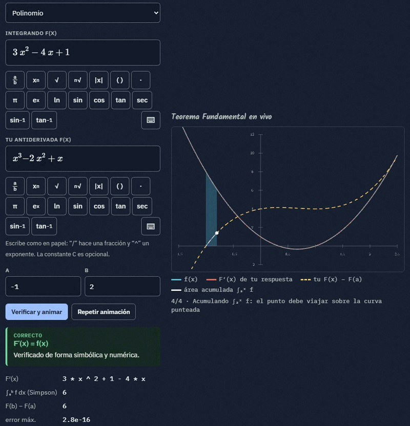
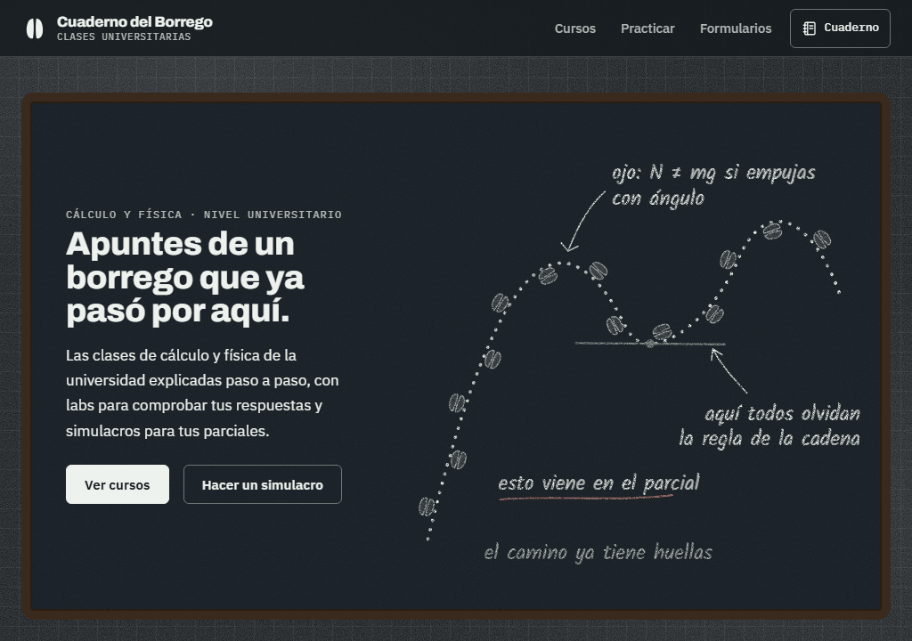
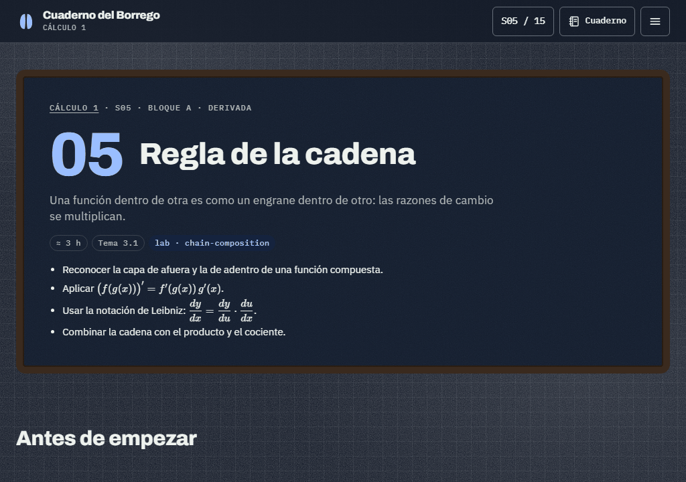
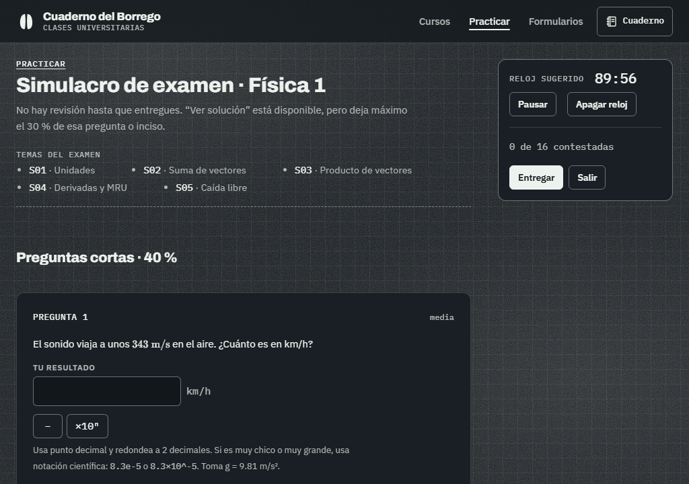

# Cuaderno del Borrego

[](https://github.com/luisxavierxd/CuadernoDelBorrego/actions/workflows/validate.yml)
[](LICENSE)
[](LICENSE-CONTENT.md)

**[▶ Ver el sitio](https://luisxavierxd.github.io/CuadernoDelBorrego/)**



| Hub | Lección | Simulacro de examen |
|---|---|---|
|  |  |  |

Clases universitarias de cálculo y física, autogestionadas y pensadas para quien batalla con la materia.
Ya están completos los dos primeros cursos (15 sesiones cada uno); Cálculo 2 y 3 (ecuaciones diferenciales)
y Física 2 y 3 están en el plan. Cada sesión trae una lección explicada paso a paso, un lab que compara tu
respuesta contra la real, ejercicios parametrizados y quiz; cada curso tiene banco de preguntas, simulacros
de examen y formulario imprimible. Sitio estático para GitHub Pages. **Proyecto de alumnos, no oficial.**

### Qué lo hace distinto

Los labs no solo dicen «mal»: comparan tu respuesta con la real y te dicen en qué te equivocaste
(el signo, un factor, el dominio) mientras lo dibujan. Cada sesión tiene un banco de 100 preguntas
parametrizadas, y los simulacros arman parciales con problemas de incisos encadenados. Todo se valida
en cada push: esquemas, cientos de instancias de ejemplos y ejercicios, contraste WCAG AA en ambos temas
y Playwright a 360, 1024 y 1440 px.

Diseño instruccional, arquitectura de datos y estrategia de validación: Luis Xavier. Implementación asistida por IA (Claude Code).

HTML/CSS/JS vanilla, **sin build step ni framework**. Librerías por CDN con versión fija:
KaTeX 0.16.47, math.js 15.2.0, MathLive 0.110.0, anime.js 3.2.1 y manim-web 0.3.24 (3D solo en PC).

## Estructura

```
index.html                         Hub: hero, cómo funciona, biblioteca y atajos de práctica
calculo-1/ · fisica-1/             Portadas de curso
  sesiones/sesion-NN/index.html    Shell mínimo de cada sesión (lo crea scripts/make-shell.js)
quiz/                              Lanzador de práctica (quiz, simulacro, personalizado) e historial
quiz/examen/                       Intento y revisión de un examen (?intento=ID)
formularios/<curso>/               Formulario imprimible en carta (≤ 2 hojas), con temas a la medida
creditos/                          Créditos y licencias
shared/css/tokens.css              ÚNICO archivo con colores (cuaderno claro y pizarrón oscuro)
shared/css/*.css                   base, theme, home, course, sesion, labs, quiz, formulario
shared/js/theme.js                 Tema claro/oscuro, clave 'cb-theme', evento 'cb:themechange'
shared/js/site-menu.js             Menú lateral ☰ en todas las páginas
shared/js/session-template.js      CBTemplate.render(SESSION_DATA)
shared/js/math-render.js           KaTeX con CBMath.tidy (limpia "1x", "+ −", x^{1}…) y reintento
shared/js/labs/registry.js         window.Labs · window.LabMath · window.LabUI
shared/js/labs/<tipo>.js           Un archivo por lab (antiderivative-check, projectile-check…)
shared/js/diagrams/<curso>.js      Diagramas SVG de cada curso: Diagrams[id](state)
shared/js/diagrams/examen.js       Graficador genérico exam-fn y escenas compartidas de examen
shared/js/exercises.js             Ejercicios parametrizados y su calificación (notación científica, holgura)
shared/js/math-input.js            Editor de fórmulas estilo WebAssign (MathLive + paleta de símbolos)
shared/js/latex-to-math.js         LaTeX del editor → sintaxis de math.js
shared/js/quiz/engine.js           Selección, calificación, semáforo, arrastre de error, simulacro
shared/js/quiz/ui.js               Tarjetas, semáforo, quiz de práctica, simulacro y lanzador
shared/js/quiz/bank-kit.js         Constructores de preguntas de los bancos
shared/js/formulario.js            Selector de temas y paginado de hojas carta
data/courses.js                    Fuente única de cursos del hub
data/quiz-presets.js               Atajos del ritmo sugerido (quiz y parciales)
data/<curso>/course-meta.js        Bloques y sesiones (ready: true = sesión publicada)
data/<curso>/sesion-NN.js          Contenido de cada sesión (window.SESSION_DATA)
data/<curso>/bank/sesion-NN.js     Banco de 100 preguntas de la sesión
data/<curso>/exam-problems.js      Problemas de examen con incisos encadenados y figura
data/<curso>/formulario.js         Fórmulas del formulario, con comprobación numérica
reference/lab-antiderivada.html    Demo aprobada que se portó a antiderivative-check
scripts/                           Validación en Node
.github/workflows/validate.yml     CI: npm run validate en cada push y PR; links externos cada semana
docs/media/                        GIF y capturas de este README
```

## Cómo es una sesión

La lección (`lesson[]`) va primero y está pensada para leerse sin prisa:

| Bloque | Para qué |
|---|---|
| `warmup` · «Antes de empezar» | La idea en una frase, qué hay que recordar y para qué sirve |
| `concept` «Imagínalo así» | La intuición con situaciones cotidianas, antes de las fórmulas |
| `concept`, `explainer`, `callout` | La teoría; el explainer anima un diagrama paso a paso |
| `recipe` · «Receta paso a paso» | El procedimiento numerado, con avisos «Ojo:» donde más se equivocan |
| `example` | Ejemplos resueltos que se revelan paso a paso (verificados en `examples.test`) |
| `faq` · «Dudas comunes» | Preguntas desplegables con las confusiones típicas |
| `recap` · «Lo que te llevas» | Resumen de 4 puntos |

Después vienen el lab, los ejercicios, los errores comunes y el quiz.

## Previsualizar y validar

```bash
python -m http.server 8000      # y abre http://localhost:8000
npm install                     # instala Playwright y math.js (solo para las pruebas)
npm run validate                # todo lo de abajo, en orden, con resumen de tiempos
npm run check                   # esquemas, links internos y externos, colores fuera de tokens, pie de página
npm run contrast                # WCAG AA de los tokens en ambos temas
npm run test:labs               # LabMath de cada lab y limpieza de LaTeX
npm run test:examples           # ejemplos y ejercicios contra LabMath, en cientos de instancias
npm run test:quiz               # motor de quizzes, bancos (100 por sesión) y problemas de examen
npm run test:formulario         # fórmulas comprobadas; hojas carta, ≤ 2 hojas
npm run qa                      # Playwright: 360/1024/1440 px, ambos temas, reduced-motion, labs montados
```

`npm run validate:all` ignora la caché. `npm run validate -- --offline` (o `node scripts/check.js --offline`) omite
la revisión de links externos; así corre el CI en cada push y PR, y una vez por semana revisa también los externos
([`.github/workflows/validate.yml`](.github/workflows/validate.yml)).
Para publicar una sesión nueva: escribe `data/<curso>/sesion-NN.js`, marca `ready: true` en su
`course-meta.js` y corre `node scripts/make-shell.js <curso> NN`.

## Reglas

- Todo color sale de `shared/css/tokens.css`; ningún componente nombra la materia (`data-subject` en `<body>` elige el acento).
- Las figuras usan clases de rol (`.ref`, `.aux`, `.error`, `.trace`, `.axis`, `.ann`), nunca colores directos, y ningún texto se encima con lo graficado.
- Toda animación respeta `prefers-reduced-motion`.
- Todo lo imprimible, en hoja carta.
- Todo concepto sale de una fuente verificable (OpenStax, CC BY-NC-SA 4.0) y va en la bibliografía de la sesión; ejercicios y problemas son propios.

## Licencia

- **Código:** MIT, ver [`LICENSE`](LICENSE).
- **Contenido educativo** (lecciones adaptadas de OpenStax; ejemplos, ejercicios, problemas, bancos y formularios propios): CC BY-NC-SA 4.0, ver [`LICENSE-CONTENT.md`](LICENSE-CONTENT.md).
